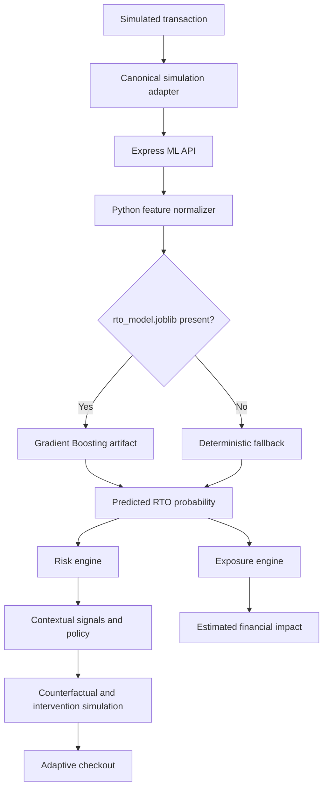
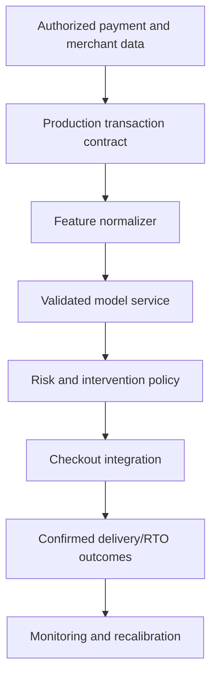

# RTO Shield

AI-assisted RTO risk and decision intelligence for simulated merchant transactions.

RTO Shield follows the loop **Predict -> Understand -> Explain -> Intervene -> Measure**. It is a prototype decision layer between transaction risk and checkout, not a live Razorpay integration.

## 1. The Problem

Return-to-Origin (RTO) occurs when an order is not delivered and returns to the merchant. Cash on Delivery increases exposure because shipping and handling costs can be incurred before payment is collected. Blanket COD blocking protects margin but can add unnecessary friction for legitimate customers. Merchants need order-level evidence and graduated interventions instead of a binary block.

## 2. The Solution

The application combines a transaction risk signal with address, history, velocity, network, behavior, and optional AI context. It then applies merchant policy, shows counterfactual options, adapts a simulated checkout, and calculates expected exposure. All current order and outcome data is seeded or simulated.

## 3. Features

### ML prediction and risk intelligence

The app exposes predicted RTO probability separately from its multi-signal policy score. The risk engine combines the ML signal with deterministic analyzers and feeds the decision engine.

### Counterfactual analysis

The transaction detail view evaluates feature mutations through the client deterministic fallback. It calculates baseline and modified predictions for phone verification, prepaid state, address completion, and network changes. These counterfactuals are not yet routed through the authoritative Python artifact service, so they must be treated as fallback-model simulations, not artifact-model explanations.

### Intervention optimizer

The existing optimizer supports `conservative`, `balanced`, and `conversion_first` policy modes, trust-aware rules, OTP, prepaid recommendations, and COD policy. Projected impacts are explicitly marked as `business_simulation`; they are not calibrated model predictions.

### Adaptive checkout

`/adaptive-checkout` presents a private merchant view and neutral customer-facing actions. The customer view does not expose risk scores, fraud language, abuse scores, or internal customer classifications.

### Abuse Sentinel

Network analysis uses seeded customers, orders, devices, addresses, graph nodes, and edges. It can surface shared-device and high-return relationships. The current relationships are simulated and are not live payment-platform signals.

### Exposure intelligence

For an assessed order:

```text
Expected RTO Exposure = Order Value × Predicted RTO Probability
```

The checkout preview also shows a potential reduction based on the current policy simulation. Merchant cost assumptions can be configured in Settings. These values are estimated or potential impact, never guaranteed savings. Portfolio projected exposure currently remains equal to baseline because portfolio-level intervention projections are not yet implemented.

### Policy simulator, analytics, and model status

Existing pages cover policy simulation, live operations, outcome feedback, held-out evaluation metadata, confusion matrices, feature metadata, and threshold analysis. The model-status page explicitly indicates when the primary artifact is unavailable.

## 4. System Architecture



## 5. ML Architecture

`ml/preprocess.py` defines a 28-value feature vector. Features include customer history, rates, order value, payment method, pincode risk, address completeness, checkout behavior, intent, device links, and product-category flags.

`ml/train.py` trains a scikit-learn `GradientBoostingClassifier` and writes `ml/models/rto_model.joblib`, `model_trees.json`, `model_meta.json`, and `model_manifest.json`. The current checkout contains the generated artifact. `ml/predict.py` loads it and returns `modelSource: artifact`, the feature schema version, artifact SHA-256, dataset name, and manifest name. If the artifact is unavailable, it explicitly returns `modelSource: deterministic_fallback`.

The Express route `/api/ml/rto-predict` invokes `ml/predict.py`. It returns probability, score, model source, version, and fallback diagnostics. The Python process is started per request and the artifact is loaded per request when available; this is suitable for the prototype but not a production serving design.

Probabilities are not calibrated confidence values. The UI uses “Predicted RTO Probability” and does not present distance from 0.5 as model confidence.

## 6. Dataset

The repository contains a synthetic/demo dataset generated by `ml/generate_data.py`. The target label is generated from overlapping historical, payment, address, behavior, network, and category signals, including the derived `intent_score`. This creates an optimistic synthetic benchmark and is not evidence of production performance.

| Split | Samples |
|---|---:|
| Training | 52,242 |
| Validation | 11,398 |
| Held-out test | 11,360 |
| Total | 75,000 |

The held-out test set is read by `ml/evaluate.py`. It is not used for training. Evaluation refuses to run without the artifact and verifies the manifest SHA-256 and feature schema before scoring.

## 7. Model Performance

The current repository evaluation run on 11,360 synthetic test rows produced:

| Metric | Value |
|---|---:|
| Accuracy | 98.42% |
| Precision | 97.22% |
| Recall | 94.85% |
| F1 | 96.02% |
| ROC-AUC | 0.9986 |
| False positive rate | 0.68% |
| False negative rate | 5.15% |

Confusion matrix: TN 9,008, FP 62, FN 118, TP 2,172.

These are synthetic/demo benchmark results from the current evaluator and must not be interpreted as production performance. Production calibration requires representative merchant transactions and confirmed RTO outcomes.

Threshold analysis for 0.30, 0.40, 0.50, 0.60, and 0.70 is generated by `ml/evaluate.py` and exported by the training metadata when the pipeline is run.

## 8. Feature Engineering

The model vector includes:

- Customer history: previous orders, delivered orders, RTO orders, cancelled orders, RTO rate, success rate, account age proxy.
- Payment and order: order value, item count, discount, COD indicator.
- Address and location: pincode RTO rate, address completeness, address changes, city/state match.
- Behavior: checkout attempts, duration, cart revisions, quantity changes, payment attempts, session duration, intent score.
- Network and category: device-linked accounts and one-hot product category fields.

The Python normalizer is authoritative for model-vector ordering. Application data reaches it through the simulation adapter and Express payload transformation.

## 9. Counterfactual Decision Engine

The intended flow is:

```text
Baseline -> feature mutation -> same predictor -> new probability -> reduction
```

The current TypeScript counterfactual engine uses the deterministic fallback directly. It does not call the active Express artifact path, so its output is labeled by the surrounding product as simulation/fallback behavior. Prepaid incentives and policy effects are business simulations because they are not direct trained features.

## 10. Intervention Optimizer

The optimizer ranks graduated actions such as no intervention, soft nudge, OTP, verification plus prepaid incentive, and prepaid-only policy. Strategy selection changes threshold behavior:

- `conservative`: lower thresholds and more protection.
- `balanced`: default tradeoff.
- `conversion_first`: higher thresholds and less friction.

Projected risk impact is heuristic business simulation, not a claim about calibrated model response. The objective weights are not scientifically validated universal costs.

## 11. Adaptive Checkout

The selected transaction is stored in Zustand and the checkout analysis stores its risk and decision. `/adaptive-checkout` reads that same active analysis. Customer-facing copy is neutral, while merchant-only panels contain predicted risk and intervention reasoning. Order placement calls the backend payment-validation endpoint as well as local policy validation.

## 12. Abuse Sentinel

The sentinel builds relationships from seeded customer/order/device/address data and network graph structures. Evidence includes linked devices, cluster size, and historical return behavior. It is simulation data only; no live Razorpay, payment, logistics, or merchant feed is connected.

## 13. Financial Intelligence

Order exposure is calculated dynamically from order value and predicted probability. Configurable forward shipping, reverse shipping, RTO processing, and handling assumptions are available in Settings. The current implementation does not calculate a separate intervention incentive net-benefit field, and portfolio projected exposure is a documented limitation.

## 14. Policy Simulator

The policy simulator models verification thresholds, prepaid thresholds, incentive values, COD fees, strictness, and high-risk-pincode treatment. Its monthly order, conversion, loss, and exposure figures are scenario estimates based on simulation inputs, not observed merchant results.

## 15. Responsible AI

- Current data is synthetic/demo data.
- Production use requires representative transaction and outcome data.
- Only necessary transaction and risk signals should be processed.
- Model-derived output, deterministic contextual signals, and business simulations should remain distinct.
- Merchant policy remains configurable and human-controlled.

## 16. Production Integration Architecture



No Razorpay integration is present in this repository. Production work would require authorized payment, logistics, and outcome integrations, authentication, rate limiting, durable model serving, calibration, drift monitoring, and merchant-specific validation.

## 17. Tech Stack

- Frontend: React 19, TypeScript, Vite, React Router, Zustand.
- UI and visualization: Tailwind CSS via Vite, Lucide React, Recharts, XYFlow.
- Backend: Node.js with Express, CORS, dotenv, and optional server-side Gemini SDK integration.
- ML: Python, scikit-learn-compatible training path, CSV preprocessing, optional joblib artifact loading.
- Tests: Vitest and TypeScript build checks.

## 18. Project Structure

```text
RTO Shield/
├── src/
│   ├── ai/                 Optional Gemini contextual analysis
│   ├── components/         Checkout and application layout components
│   ├── data/               Seed data, persistence, simulation adapter
│   ├── engine/             Risk, ML fallback, policy, counterfactual, exposure
│   ├── pages/              Dashboard and decision-intelligence routes
│   ├── store/              Zustand risk and settings state
│   └── types/              Shared TypeScript contracts
├── server/index.js         Express API
├── ml/
│   ├── data/               Synthetic train/validation/test CSV files
│   ├── models/             Metadata and optional generated artifacts
│   ├── preprocess.py       Canonical Python feature vector
│   ├── train.py            Training and artifact export
│   ├── predict.py          Artifact/fallback inference
│   └── evaluate.py         Held-out evaluation and thresholds
├── tests/                  Vitest tests
├── public/
├── package.json
└── README.md
```

## 19. Local Setup

```bash
npm install
```

The frontend and API use the scripts below. Python dependencies are not declared in a repository requirements file; install a compatible Python environment with the modules required by the ML scripts, including scikit-learn and joblib when using artifact training/inference.

Optional Gemini analysis reads `GEMINI_API_KEY` from the server environment. Do not place secrets in frontend code or commit `.env` files.

## 20. Running the Application

Terminal 1:

```bash
npm run server
```

Terminal 2:

```bash
npm run dev
```

Open `http://localhost:5173/`. The Vite API proxy forwards `/api` to `http://localhost:3001`.

Other package scripts are `npm run build`, `npm test`, `npm run lint`, and `npm run preview`.

## 21. ML Pipeline

```bash
python ml/train.py
python ml/evaluate.py
python ml/predict.py
```

Training reads the existing split and writes the artifact, portable tree export, metadata, and manifest. Evaluation reads `ml/data/test.csv` and requires the exact artifact/manifest pair. Prediction accepts a JSON argument or uses its built-in sample. Running training changes model artifacts and should be an intentional model lifecycle action, not a demo startup step.

## 22. API Documentation

### `GET /api/health`

Returns API health, model status, and whether Gemini is configured.

### `POST /api/ml/rto-predict`

Accepts `customer`, `order`, `address`, and `behavior` objects. The active frontend sends previous order counts, order value, payment method, address fields, and checkout behavior. Returns `rtoProbability`, `riskScore`, `modelVersion`, `modelSource`, and fallback diagnostics when applicable. Invalid order values return HTTP 400; inference failures return HTTP 500.

### `POST /api/risk/predict`

Compatibility endpoint that delegates to the same Python inference service.

### `GET /api/ml/metrics`

Returns checked-in evaluation metadata, feature schema, threshold analysis when exported, evaluation source, and artifact availability.

### `POST /api/policy/payment-policy`

Maps a supplied risk level/probability to the current COD, UPI, card, fee, and checkout message policy.

### `POST /api/checkout/validate-payment`

Validates the selected payment method against the submitted risk policy and returns validity, applied fee, and final amount. The prototype has no authentication or signed decision token, so this is not a production authorization boundary.

### `POST /api/risk/simulate`

Runs the existing policy scenario simulation.

### `GET /api/abuse-rings`

Returns the current simulated abuse-ring fixture data.

### `POST /api/ai/analyze`

Calls Gemini server-side when `GEMINI_API_KEY` is configured; otherwise returns an unavailable response.

## 23. Testing

```bash
npm test
npm run build
python ml/evaluate.py
```

The current suite covers risk analyzers, decision and feedback behavior, seeded-data distributions, model fallback/exposure contracts, and acceptance criteria. It does not yet provide a full authenticated API integration suite or browser automation suite.

## 24. Limitations

- The primary `rto_model.joblib` artifact is present in this checkout and runtime predictions use it through Python. The deterministic fallback remains available only when the artifact is unavailable.
- Counterfactuals do not yet invoke the same API/artifact path as the active checkout prediction.
- Intervention projections are business simulations, not calibrated model outputs.
- Portfolio projected exposure and net intervention benefit are not fully implemented.
- Dataset, network relationships, policy simulator values, and insight fixtures are synthetic/demo data.
- No live Razorpay, payment, logistics, or merchant database integration exists.
- API CORS is unrestricted and there is no authentication, rate limiting, or durable model-serving process.
- Probabilities are not calibrated confidence values.

## 25. Roadmap

### Current prototype

Simulation-mode transaction analysis, risk policy, counterfactual fallback simulation, adaptive checkout preview, exposure calculation, synthetic evaluation, and responsible-AI disclosures.

### Production roadmap

Authorized merchant/payment/logistics adapters, artifact registry and persistent model service, schema validation and authentication, calibration, drift monitoring, merchant-specific policy/model evaluation, outcome feedback, A/B testing, and online monitoring.

## 26. Hackathon Context

RTO Shield demonstrates how payment and checkout infrastructure can use transaction risk intelligence to protect merchant economics while preserving conversion for legitimate customers. The repository is a simulation prototype and does not claim official Razorpay integration or production validation.

## 27. License

No license file is present in the repository.
