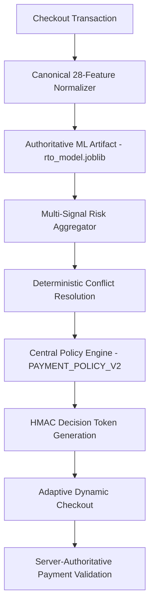

# RTO Shield

AI-assisted Return-to-Origin (RTO) risk and decision intelligence for e-commerce checkouts.

RTO Shield operates on the closed-loop cycle: **Predict → Understand → Explain → Intervene → Measure**. It functions as an authoritative decision and policy layer between transaction risk and dynamic checkout. It is an advanced hackathon prototype and decision architecture, not a live Razorpay integration.

---

## 1. The Problem

In Indian e-commerce, **Cash on Delivery (COD)** accounts for over 60% of retail transactions but suffers from severe Return-to-Origin (RTO) rates of 20% to 40%. When an order returns undelivered:
- The merchant incurs forward and reverse logistics shipping costs (₹150–₹400 per shipment).
- Inventory is locked in transit for 10–18 days, leading to stock depreciation.
- Payment is never collected.

Blanket COD bans protect margins but devastate customer acquisition and conversion. Merchants require order-level evidential intelligence, non-destructive nudges, and server-authoritative enforcement rather than a blunt binary block.

## 2. The Solution

RTO Shield combines an authoritative 28-feature Gradient Boosting ML model with deterministic contextual analyzers across:
1. **Address Intelligence** (premise structure, pincode risk, completeness)
2. **Customer History** (delivery track record, historical return rate)
3. **Network Signals** (device fingerprint collisions, shared IPs, cluster topology)
4. **Velocity Signals** (short-window burst detection)
5. **Behavioral Signals** (checkout friction, duration, revision frequency)
6. **Machine Learning** (authoritative GBDT inference artifact)
7. **AI Context** (Gemini contextual address/intent explanation — optional advisory signal)

The output feeds into a centralized policy engine that enforces dynamic checkout rules:
- **Low Risk (0–30%)**: Frictionless COD available with ₹0 fee.
- **Medium Risk (31–70%)**: Soft nudge with ₹50 COD convenience fee; free UPI/Card recommended.
- **High Risk (71–100%)**: COD restricted; purchase permitted via prepaid UPI/Card.

---

## 3. Core Terminology & Evidence Disclosure

To prevent misleading claims, all metrics and system states are explicitly classified:

| Classification | Meaning in RTO-Shield |
|---|---|
| **BENCHMARK** | Held-out test evaluation on a 11,360-sample synthetic split (`ml/models/model_manifest.json`). Not live production performance. |
| **OBSERVED** | Runtime application state, seeded customer accounts, and recorded delivery feedback events. |
| **SIMULATED** | Counterfactual toggle evaluations, threshold impact projections, and interactive checkout scenarios. |
| **ESTIMATED** | Financial exposure calculations based on configurable merchant unit economics. |
| **DEMO** | Abuse Sentinel graph constellation clusters and seeded demo transactions. |

---

## 4. End-to-End Decision Architecture



### Single Authoritative Decision Flow
1. **Transaction Ingestion**: Customer, order, address, and behavioral signals are formatted according to the canonical `rto-features-v1` contract.
2. **Authoritative ML Artifact**: Evaluated by the primary `rto_model.joblib` artifact (SHA-256: `921353523dda484b9e87afc6e9efd934dc30dd12c179baf03ebf3caa3181f39c`).
3. **Multi-Signal Aggregation**: Multi-signal scoring with deterministic conflict resolution (e.g. coordinated abuse cluster overrides optimistic single-feature signals).
4. **Central Policy Engine**: Maps the risk tier to merchant action (`ALLOW_ALL`, `SOFT_NUDGE`, `PREPAID_ONLY`).
5. **HMAC Decision Token**: Server signs an immutable token containing `orderId`, `amount`, `riskLevel`, and expiration time.
6. **Server-Authoritative Checkout**: Client cannot manipulate risk level or amount. Payment validation checks token signature, expiration, order binding, and amount integrity.

---

## 5. Security & Authoritative Checkout Architecture

RTO-Shield enforces zero trust towards client-submitted risk values:

### Server-Authoritative Decisioning
- **Client Risk Manipulation Blocked**: The endpoint `POST /api/checkout/validate-payment` ignores any client-sent `riskLevel`, `riskScore`, or `decision`. If an attacker submits `riskLevel: "LOW"` on a high-risk order, the server strictly evaluates the authoritative risk and returns HTTP 403 Forbidden.
- **Amount Integrity Verification**: The payable amount is verified against the server's authoritative state and the signed decision token. Attempts to pay ₹1 for a ₹1899 order are rejected with HTTP 400 (`AMOUNT_MISMATCH`).
- **Decision Replay Protection**: Decision tokens are HMAC-SHA256 signed and strictly bound to `orderId`. An attacker cannot reuse a valid decision token from Order A on Order B (`ORDER_BINDING_MISMATCH`).
- **Idempotency Protection**: Supports `Idempotency-Key` headers. Replaying the identical payload returns the cached result without duplicate processing. Replaying the key with modified parameters is rejected with HTTP 409 Conflict (`IDEMPOTENCY_CONFLICT`).
- **CORS & Rate Limiting**: Environment-aware CORS allowlist; sliding-window rate limiting on checkout (60 req/min), ML inference (120 req/min), and AI analysis (40 req/min).

---

## 6. ML Model & Provenance

- **Algorithm**: `sklearn.ensemble.GradientBoostingClassifier`
- **Model Version**: `RTO Shield GBDT v1`
- **Feature Contract**: `rto-features-v1` (28 canonical features)
- **Primary Artifact**: `ml/models/rto_model.joblib`
- **Verified SHA-256 Hash**: `921353523dda484b9e87afc6e9efd934dc30dd12c179baf03ebf3caa3181f39c`
- **Fallback State**: Explicitly labeled `deterministic_fallback`, active only if the primary artifact file is unavailable.

### Canonical 28 Features
1. `previous_orders`
2. `previous_delivered_orders`
3. `previous_rto_orders`
4. `previous_cancelled_orders`
5. `customer_rto_rate`
6. `customer_success_rate`
7. `days_since_first_order`
8. `order_value`
9. `number_of_items`
10. `discount_percentage`
11. `cod_selected`
12. `pincode_rto_rate`
13. `address_completeness`
14. `address_changes`
15. `city_state_match`
16. `checkout_attempts`
17. `checkout_duration`
18. `cart_revisions`
19. `quantity_changes`
20. `payment_attempts`
21. `session_duration`
22. `intent_score`
23. `device_linked_accounts`
24. `cat_ELECTRONICS`
25. `cat_FASHION`
26. `cat_BEAUTY`
27. `cat_HOME`
28. `cat_ACCESSORIES`

### Benchmark Evaluation (Held-Out Test Set: 11,360 Samples)

| Metric | Benchmark Value |
|---|---:|
| Accuracy | 98.32% |
| Precision | 96.38% |
| Recall | 95.24% |
| F1 Score | 95.80% |
| ROC-AUC | 0.9984 |
| False Positive Rate (FPR) | 0.90% |
| False Negative Rate (FNR) | 4.76% |

Confusion Matrix: True Negative 8,988 | False Positive 82 | False Negative 109 | True Positive 2,181.

---

## 7. Authoritative Counterfactual Engine

The counterfactual engine answers: *"What would have to change for this order to become safer?"*
- **Authoritative Batch Route**: `POST /api/ml/counterfactual` executes baseline and toggle-mutated payloads (`phoneVerification`, `prepaidPayment`, `verifiedAddress`, `removeSuspiciousNetwork`) as a single batch through the authoritative Python GBDT artifact.
- **Explainable Point Attribution**: Quantifies exact risk point reduction for each intervention.
- **Graceful Fallback**: If backend inference is unreachable, falls back to deterministic simulation clearly labeled as `deterministic_fallback`.

---

## 8. Responsible AI & PII Protection

- **PII Minimization**: Phone numbers (`[PHONE_MASKED]`), emails (`[EMAIL_MASKED]`), and door numbers are redacted before sending data to Gemini.
- **Gemini is Advisory**: Gemini provides qualitative explanations only (5% weight). It has zero authority to approve or block orders.
- **Hard Timeout**: 5-second hard limit on AI calls prevents checkout latency degradation.
- **Customer-Safe Language**: The customer view never displays "fraud", "risk score", or "blacklisted". Only neutral, constructive payment options are shown.

---

## 9. API Reference

### Health & Metrics
- `GET /api/health` — System status, artifact verification status, Gemini configuration.
- `GET /api/ml/metrics` — Dynamic model metadata, manifest verification, SHA-256 hash match, threshold analysis.

### ML Inference
- `POST /api/ml/rto-predict` — Single transaction prediction using canonical 28 features.
- `POST /api/ml/batch-predict` — Batch inference (up to 50 transactions).
- `POST /api/ml/counterfactual` — Authoritative multi-scenario mutation simulation.

### Checkout & Policy
- `POST /api/policy/payment-policy` — Central risk-to-payment policy mapping.
- `POST /api/checkout/evaluate` — Server-authoritative risk evaluation; generates HMAC decision tokens.
- `POST /api/checkout/validate-payment` — Hardened payment validation enforcing amount integrity, COD policy, token validity, and idempotency.

### Intelligence & Simulation
- `POST /api/ai/analyze` — PII-sanitized Gemini contextual analysis with bounded output.
- `POST /api/risk/simulate` — Macro policy simulator for portfolio loss modeling.
- `GET /api/abuse-rings` — Graph cluster fixtures for Abuse Sentinel visualization.

---

## 10. Local Setup & Verification

### Prerequisites
- Node.js 18+
- Python 3.10+ with `scikit-learn` and `joblib`

### Installation
```bash
npm install
```

### Environment Configuration
Copy the example environment file:
```bash
cp .env.example .env
```
*(Optional: Add `GEMINI_API_KEY` for AI contextual reasoning. The application works completely without it).*

### Running the System
Terminal 1 (Backend API):
```bash
npm run server
```

Terminal 2 (Frontend Client):
```bash
npm run dev
```
Open `http://localhost:5173/` in your browser.

### Running Tests
Execute the complete test suite:
```bash
npm test
```
*(Runs 43 Vitest tests across 10 suites, including security attack tests, feature parity, counterfactuals, and policy criteria).*

Execute Python ML provenance & scenario tests:
```bash
python -m unittest discover -s ml
```
*(Runs 22 Python tests verifying artifact hash, feature extraction, scenarios, and provenance).*

Production Build Check:
```bash
npm run build
```

---

## 11. Known Limitations

1. **Synthetic Data**: The 75,000-sample dataset was synthetically generated. Real-world deployment requires training on merchant-specific historical logistics data.
2. **Razorpay Alignment**: RTO-Shield models the decision layer that sits before a payment gateway. It does not initiate real banking transactions.
3. **In-Memory Serving**: The Express API invokes the Python inference script per request. Production architecture would deploy a containerized FastAPI / Triton serving cluster.

---

## 12. Submission Readiness

| Verification Standard | Result |
|---|---|
| **Artifact SHA-256 Parity** | `921353523dda484b9e87afc6e9efd934dc30dd12c179baf03ebf3caa3181f39c` (MATCH) |
| **Server-Authoritative Checkout** | Enforced (Client risk tampering blocked) |
| **Amount Integrity** | Enforced (Amount tampering rejected) |
| **HMAC Decision Tokens** | Implemented (Replay & tampering blocked) |
| **Idempotency** | Implemented (Duplicate requests deduplicated) |
| **Rate Limiting & CORS** | Configured |
| **Automated Tests** | 43 TypeScript tests + 22 Python tests PASS |
| **Production Build** | Clean build with zero TypeScript errors |
